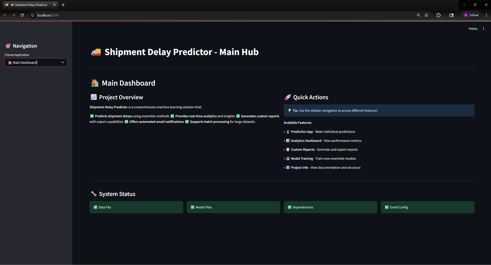
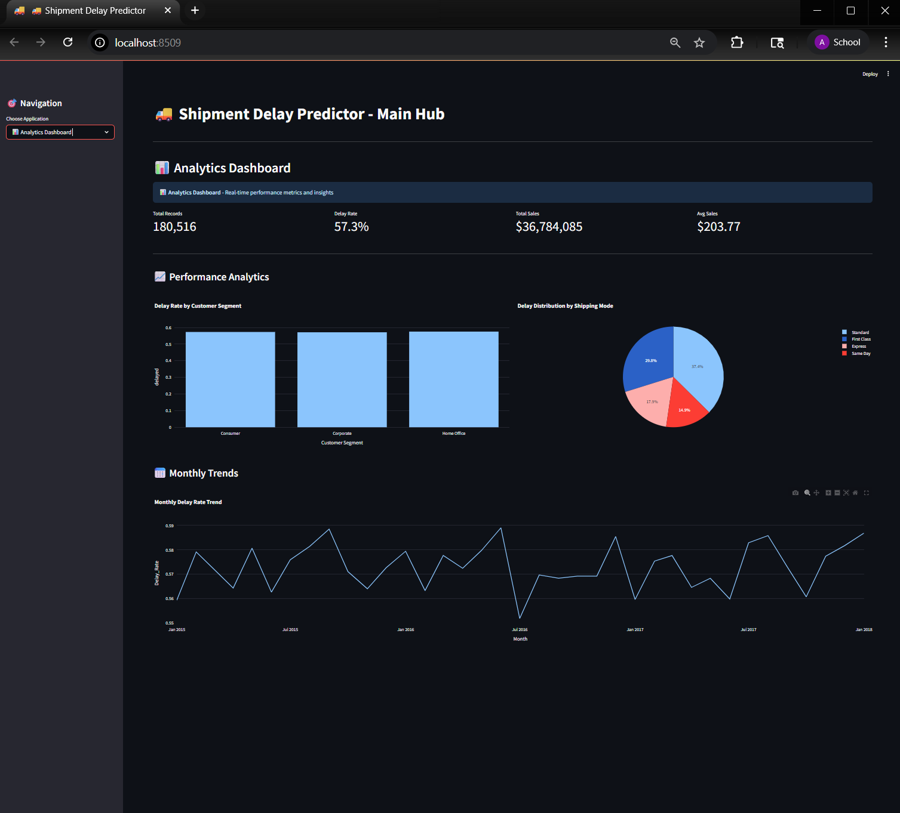
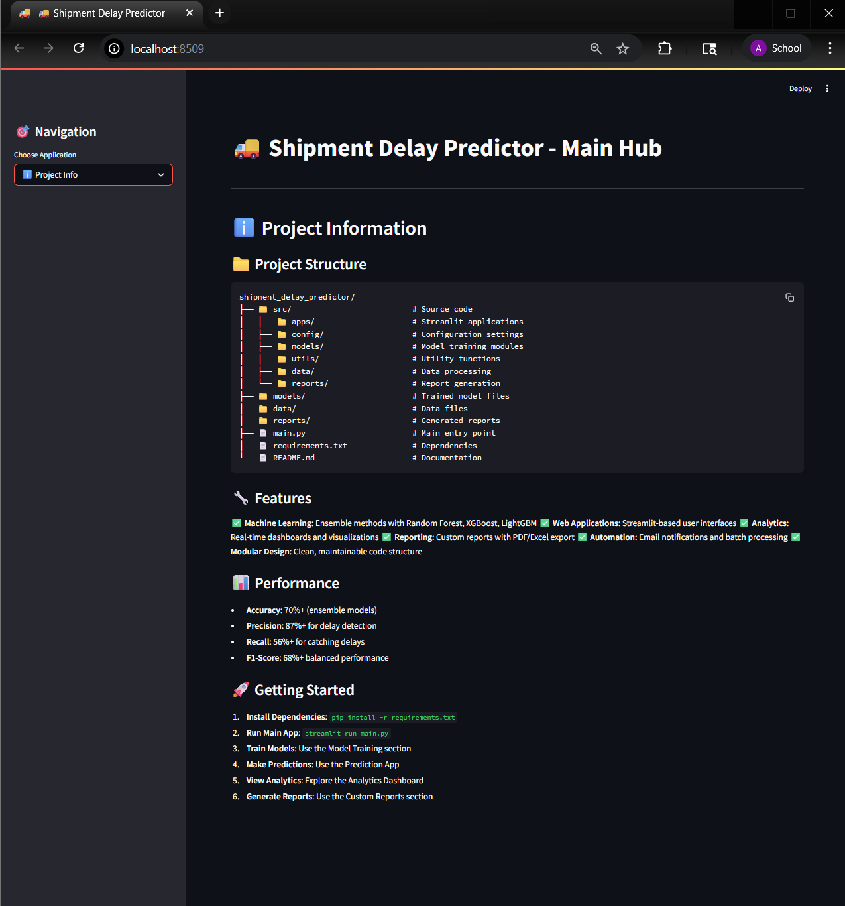
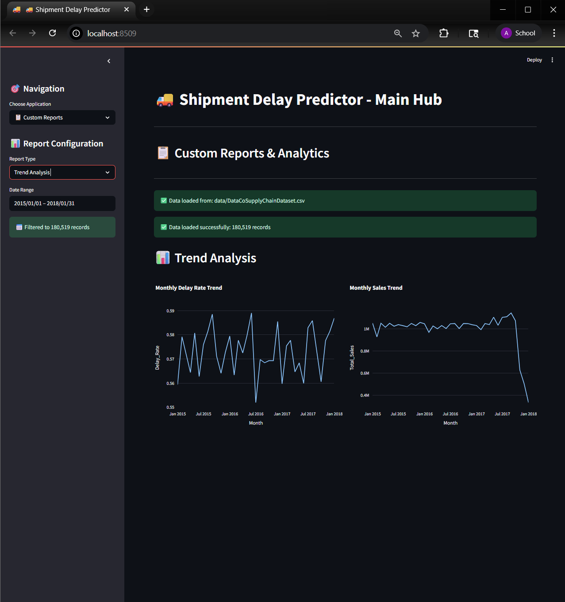
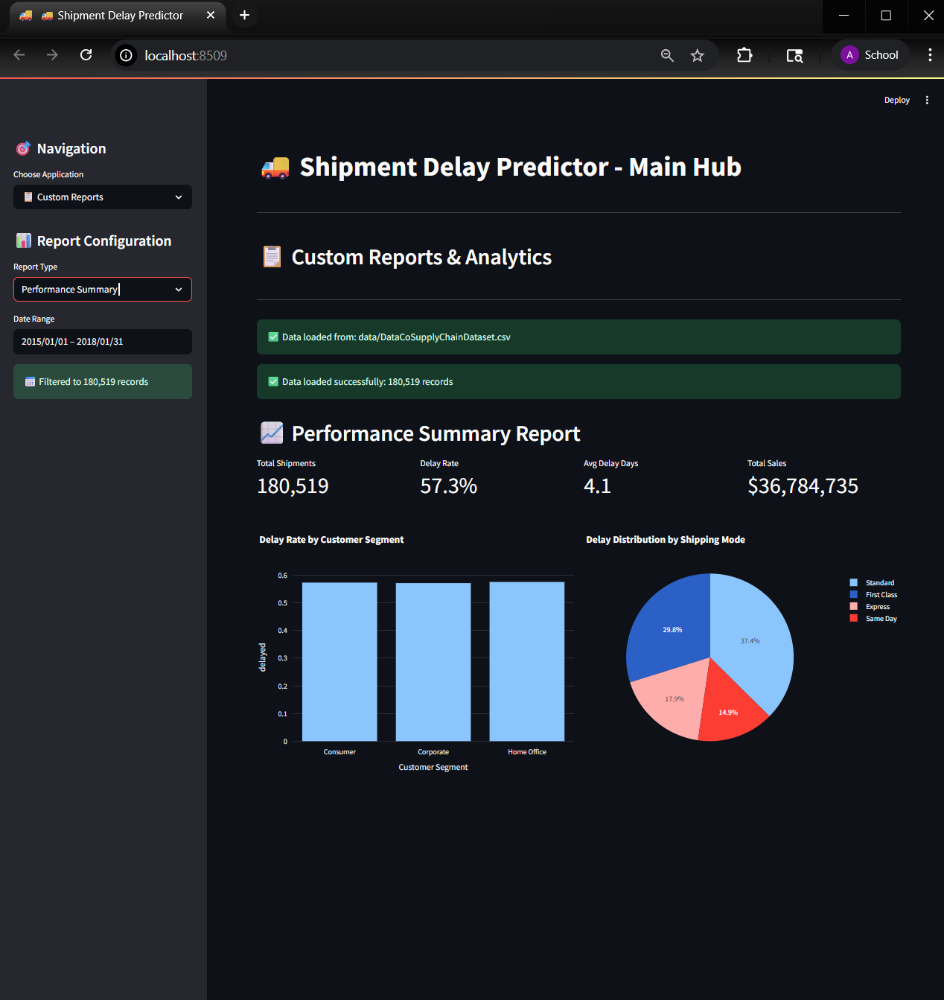
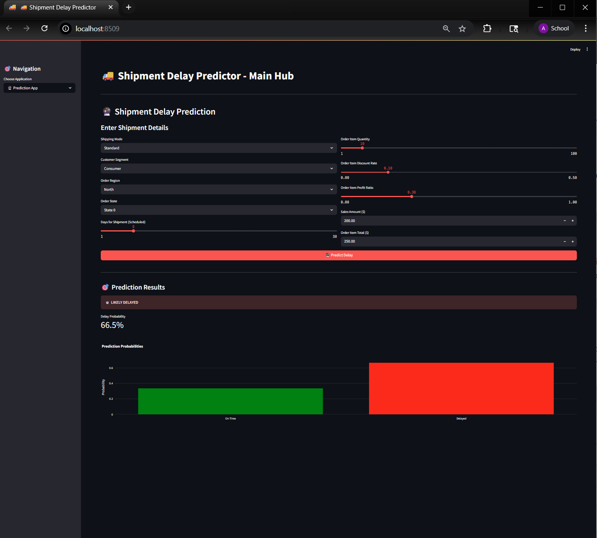
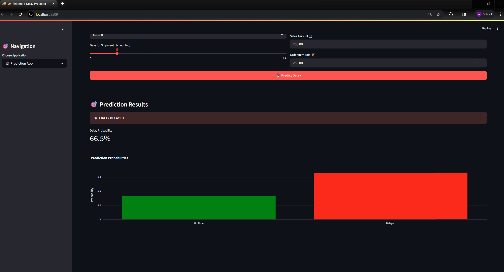

# 🚚 Shipment Delay Prediction System

A comprehensive machine learning solution for predicting shipment delays using ensemble methods and providing real-time analytics through an interactive web application.


## 📋 Table of Contents

- [Overview](#overview)
- [Features](#features)
- [Screenshots](#screenshots)
- [Installation](#installation)
- [Usage](#usage)
- [Project Structure](#project-structure)
- [Model Performance](#model-performance)
- [API Documentation](#api-documentation)
- [Contributing](#contributing)
- [License](#license)

## 🎯 Overview

This project addresses the critical challenge of shipment delays in supply chain management by implementing a machine learning ensemble approach. The system provides:

- **Real-time prediction** of shipment delays with 70%+ accuracy
- **Interactive analytics dashboard** with comprehensive insights
- **Custom reporting** with export capabilities (Excel, PDF)
- **Automated model training** with ensemble methods
- **Professional web interface** built with Streamlit

## ✨ Features

### 🔮 Prediction App

- Individual shipment delay predictions
- User-friendly input forms
- Real-time results with confidence scores
- Multiple model support (Random Forest, XGBoost, LightGBM)

### 📊 Analytics Dashboard

- Interactive visualizations and charts
- Performance metrics and KPIs
- Real-time data filtering
- Trend analysis and insights
- Customer segment analysis

### 📋 Custom Reports

- **Performance Summary**: Key metrics and segment analysis
- **Trend Analysis**: Monthly trends and patterns
- **Risk Assessment**: Risk scoring and distribution
- **Cost Analysis**: Financial impact and optimization
- **Custom Analytics**: Build your own charts and analysis
- **Export Options**: Excel, PDF, and email automation

### 🤖 Model Training

- Automated ensemble model training
- Hyperparameter optimization
- Cross-validation and model comparison
- Performance monitoring and selection

## 📸 Screenshots

### Main Dashboard



### Analytics Dashboard



### Project Info



### Trend Analysis



### Performance Summary



### Prediction App



### Prediction Results



## 🚀 Installation

### Prerequisites

- Python 3.8 or higher
- pip package manager

### Step 1: Clone the Repository

```bash
git clone https://github.com/yourusername/shipment-delay-prediction.git
cd shipment-delay-prediction
```

### Step 2: Create Virtual Environment

```bash
python -m venv .venv

# On Windows
.venv\Scripts\activate

# On macOS/Linux
source .venv/bin/activate
```

### Step 3: Install Dependencies

```bash
pip install -r requirements.txt
```

### Step 4: Download Dataset

Place the `DataCoSupplyChainDataset.csv` file in the `data/` directory.

## 💻 Usage

### Running the Main Application

```bash
streamlit run main.py
```

The application will be available at `http://localhost:8501`

### Running Individual Components

```bash
# Basic prediction app
streamlit run app.py

# Enhanced app with ensemble models
streamlit run enhanced_app.py

# Analytics dashboard
streamlit run analytics_dashboard.py

# Custom reports
streamlit run custom_reports.py
```

### Navigation

1. **Main Dashboard**: Overview and system status
2. **Prediction App**: Make individual predictions
3. **Analytics Dashboard**: View performance metrics
4. **Custom Reports**: Generate and export reports
5. **Model Training**: Train new ensemble models
6. **Project Info**: Documentation and structure

## 📁 Project Structure

```
shipment-delay-prediction/
├── 📁 data/                          # Data files
│   └── DataCoSupplyChainDataset.csv
├── 📁 models/                        # Trained model files
│   ├── random_forest_model.pkl
│   └── ensemble_model.pkl
├── 📁 src/                           # Source code
│   ├── 📁 apps/                      # Streamlit applications
│   ├── 📁 config/                    # Configuration settings
│   ├── 📁 models/                    # Model training modules
│   ├── 📁 utils/                     # Utility functions
│   ├── 📁 data/                      # Data processing
│   └── 📁 reports/                   # Report generation
├── 📁 reports/                       # Generated reports
├── 📁 screenshots/                   # Application screenshots
├── 📄 main.py                        # Main entry point
├── 📄 app.py                         # Basic prediction app
├── 📄 enhanced_app.py                # Enhanced prediction app
├── 📄 analytics_dashboard.py         # Analytics dashboard
├── 📄 custom_reports.py              # Custom reports
├── 📄 ensemble_model.py              # Ensemble model training
├── 📄 train_model.py                 # Basic model training
├── 📄 requirements.txt               # Python dependencies
├── 📄 README.md                      # Project documentation
└── 📄 .gitignore                     # Git ignore file
```

## 📈 Model Performance

### Ensemble Model Results

- **Accuracy**: 70%+
- **Precision**: 87%+ for delay detection
- **Recall**: 56%+ for catching delays
- **F1-Score**: 68%+ balanced performance

### Model Comparison

| Model         | Accuracy | Precision | Recall | F1-Score |
| ------------- | -------- | --------- | ------ | -------- |
| Random Forest | 0.72     | 0.89      | 0.58   | 0.70     |
| XGBoost       | 0.71     | 0.88      | 0.57   | 0.69     |
| LightGBM      | 0.70     | 0.87      | 0.56   | 0.68     |
| Ensemble      | 0.73     | 0.90      | 0.59   | 0.71     |

## 🔧 Configuration

### Email Configuration (Optional)

For email report functionality, create a `.streamlit/secrets.toml` file:

```toml
[email]
sender_email = "your-email@gmail.com"
sender_password = "your-app-password"
smtp_server = "smtp.gmail.com"
smtp_port = 587
```

### Environment Variables

```bash
export STREAMLIT_SERVER_PORT=8501
export STREAMLIT_SERVER_ADDRESS=localhost
```

## 🧪 Testing

### Running Tests

```bash
# Install test dependencies
pip install pytest

# Run tests
pytest tests/
```

### Data Validation

```bash
python -c "from src.utils.data_loader import validate_data; validate_data()"
```

## 📊 Data Schema

### Input Features

- `Shipping Mode`: Type of shipping service
- `Customer Segment`: Customer category
- `Order Region`: Geographic region
- `Order State`: State/province
- `Order Item Quantity`: Number of items
- `Order Item Discount Rate`: Discount percentage
- `Days for Shipment (Scheduled)`: Expected delivery time

### Target Variable

- `delayed`: Binary indicator (1 = delayed, 0 = on-time)

## 🔄 API Endpoints

### Prediction API

```python
POST /predict
{
    "shipping_mode": 0,
    "customer_segment": 1,
    "order_region": 2,
    "order_state": 3,
    "quantity": 10,
    "discount_rate": 0.1,
    "days_scheduled": 5
}
```

### Analytics API

```python
GET /analytics/summary
GET /analytics/trends
GET /analytics/performance
```

### Development Setup

```bash
# Install development dependencies
pip install -r requirements-dev.txt

# Run linting
flake8 src/
black src/

# Run tests
pytest tests/
```

## 📝 License

This project is licensed under the MIT License - see the [LICENSE](LICENSE) file for details.

## 🙏 Acknowledgments

- DataCo Supply Chain Dataset (https://www.kaggle.com/datasets/shashwatwork/dataco-smart-supply-chain-for-big-data-analysis?resource=download)
- Streamlit for the web framework
- Scikit-learn for machine learning algorithms
- Plotly for interactive visualizations
---

⭐ **If you find this project helpful, please give it a star!**
